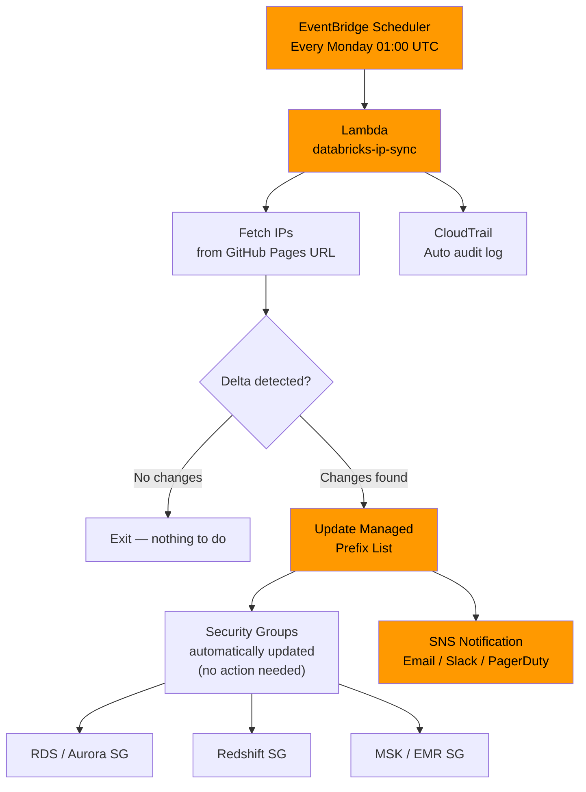
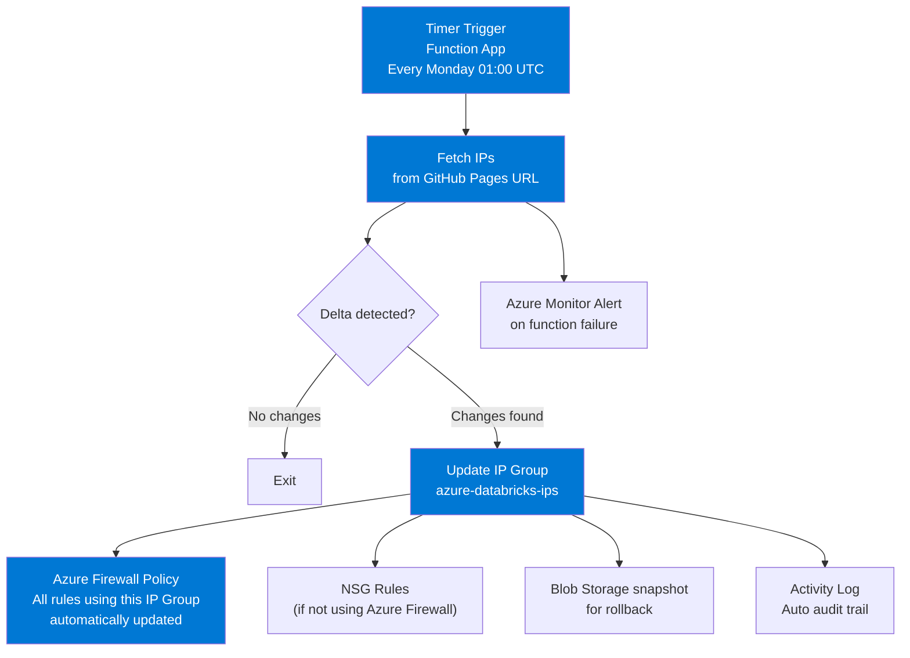
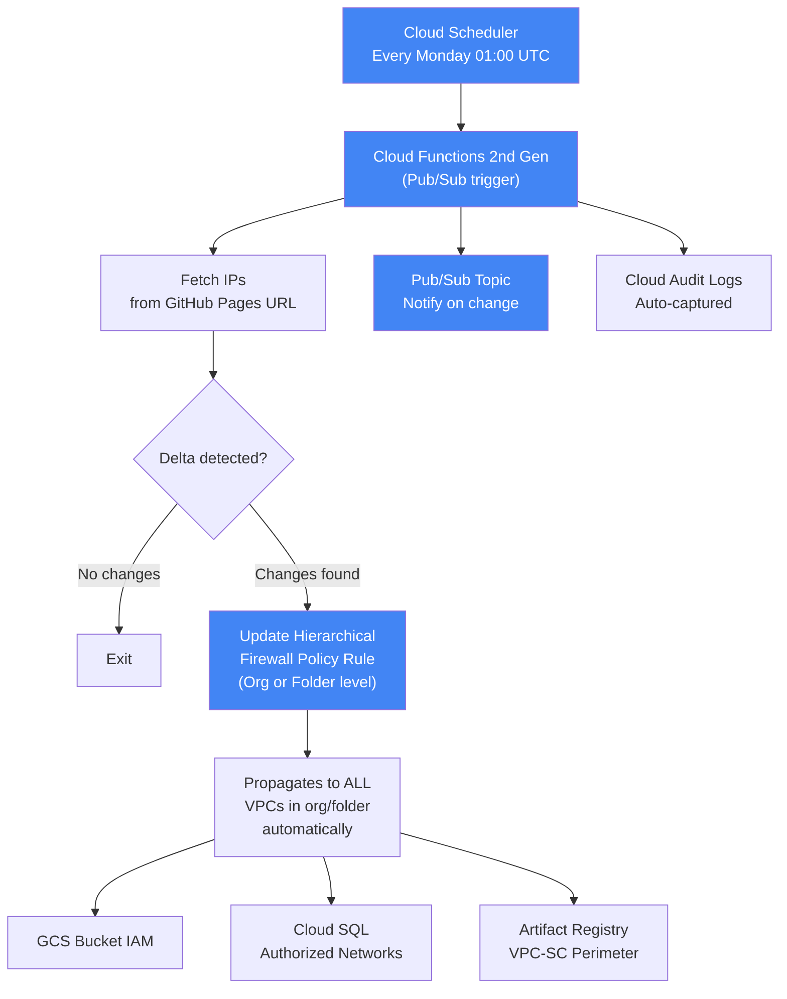
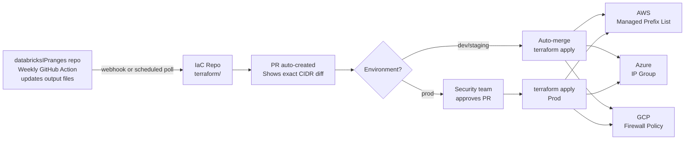

# Databricks IP Range Firewall Automation Guide

Production-grade guidance for keeping firewall rules in sync with Databricks IP ranges — automatically, reliably, and across clouds.

> **TL;DR** — Use `extract-databricks-ips.py` or the pre-generated `.txt` files from this repo to get your IPs. Feed them into a cloud-native managed object (AWS Managed Prefix List / Azure IP Group / GCP Firewall Policy). Schedule a weekly sync function. Done.

---

## Table of Contents

- [The Problem](#the-problem)
- [Step 0: Get Your IPs](#step-0-get-your-ips)
- [AWS](#aws)
- [Azure](#azure)
- [GCP](#gcp)
- [Palo Alto Networks (EDL)](#palo-alto-networks-edl)
- [GitOps / Terraform (Multi-cloud / Enterprise)](#gitops--terraform)
- [Best Practices Checklist](#best-practices-checklist)
- [Rollback Reference](#rollback-reference)

---

## The Problem

Databricks publishes IP ranges at `https://www.databricks.com/networking/v1/ip-ranges.json`. These change **every ~2 weeks**. In environments with restricted egress — storage, databases, key vaults, APIs — stale rules mean broken pipelines.

```
                        Databricks IP Ranges refresh (~2 weeks)
                                        │
                  ┌─────────────────────▼──────────────────────┐
                  │  Services that need Databricks IPs allowed  │
                  │                                             │
                  │   Object Storage   │   Databases            │
                  │   S3 / ADLS / GCS  │   RDS / SQL / Cloud SQL │
                  │                    │                         │
                  │   Key Management   │   APIs / Registries     │
                  │   KMS / KeyVault / │   Internal endpoints    │
                  │   Cloud KMS        │   Container registries  │
                  └─────────────────────────────────────────────┘
```

Manual updates don't scale. One missed update = broken jobs at 2am.

---

## Step 0: Get Your IPs

### Option A — Pre-generated files (zero setup)

Updated weekly by the GitHub Action in this repo. Direct download:

| Scope | URL pattern |
|-------|-------------|
| All clouds, all IPs | `…/output/all.txt` |
| Per cloud (all regions) | `…/output/<cloud>.txt` — `aws.txt`, `azure.txt`, `gcp.txt` |
| Per cloud, by direction | `…/output/<cloud>-<inbound\|outbound>.txt` |
| **Per region** (recommended) | `…/output/<cloud>-<region>.txt` — e.g. `aws-us-east-1.txt`, `azure-eastus.txt`, `gcp-us-central1.txt` |

Base URL: `https://bhavink.github.io/databricksIPranges`. One CIDR per line — drop it straight into a Lambda, Function, EDL, or firewall config.

> Per-region files are emitted only when the region has ≥1 CIDR. Browse [output/](https://bhavink.github.io/databricksIPranges/output/) for the live list, or `--list-regions --cloud <cloud>` via the CLI.

### Option B — `extract-databricks-ips.py` (programmatic, region-scoped)

No dependencies beyond Python 3.8+ stdlib.

```bash
# All IPs for a cloud
python extract-databricks-ips.py --cloud aws
python extract-databricks-ips.py --cloud azure
python extract-databricks-ips.py --cloud gcp

# Scope to your Databricks workspace regions (recommended)
python extract-databricks-ips.py --cloud aws --region us-east-1
python extract-databricks-ips.py --cloud azure --region eastus
python extract-databricks-ips.py --cloud gcp --region us-central1

# Multiple regions
python extract-databricks-ips.py --cloud aws --region us-east-1,us-west-2,eu-west-1

# JSON output — for programmatic consumption
python extract-databricks-ips.py --cloud aws --region us-east-1 --format json

# List all available regions
python extract-databricks-ips.py --list-regions --cloud aws
```

> **Recommendation:** Always scope to your actual Databricks workspace regions. Don't allow all regions globally — it needlessly expands your attack surface.

---

## AWS

### Architecture



### Why Managed Prefix Lists

AWS Managed Prefix Lists are the right primitive:
- Define once, **reference everywhere** — Security Groups, Route Tables, VPC Endpoint Policies
- One update propagates to **all resources** referencing the list
- Versioned — rollback to any prior version with a single API call
- Shareable across accounts via Resource Access Manager (RAM)

### Step 1: Create the Prefix List (one-time)

```bash
# Create with enough headroom (Databricks currently ~100-150 CIDRs per cloud)
aws ec2 create-managed-prefix-list \
  --prefix-list-name "databricks-ip-ranges" \
  --max-entries 200 \
  --address-family IPv4 \
  --region us-east-1

# Output: { "PrefixListId": "pl-0abc123def456..." }
# Save this ID — you'll reference it everywhere
```

### Step 2: Populate with current IPs (one-time)

```bash
# Generate add-entries JSON from current IPs
python extract-databricks-ips.py --cloud aws --region us-east-1 --format json \
  | python3 -c "
import json, sys
entries = [{'Cidr': e['cidr'], 'Description': e.get('region','')} for e in json.load(sys.stdin)]
print(json.dumps(entries))
" > entries.json

# Initial populate
aws ec2 modify-managed-prefix-list \
  --prefix-list-id pl-0abc123def456 \
  --current-version 1 \
  --add-entries file://entries.json \
  --region us-east-1
```

### Step 3: Reference it in Security Groups

```bash
# RDS Security Group — allow Databricks to connect on port 5432 (Postgres)
aws ec2 authorize-security-group-ingress \
  --group-id sg-rds-xxxxxxxx \
  --ip-permissions '[{
    "IpProtocol": "tcp",
    "FromPort": 5432,
    "ToPort": 5432,
    "PrefixListIds": [{"PrefixListId": "pl-0abc123def456", "Description": "Databricks CP IPs"}]
  }]'

# Redshift Security Group — port 5439
aws ec2 authorize-security-group-ingress \
  --group-id sg-redshift-xxxxxxxx \
  --ip-permissions '[{
    "IpProtocol": "tcp",
    "FromPort": 5439,
    "ToPort": 5439,
    "PrefixListIds": [{"PrefixListId": "pl-0abc123def456"}]
  }]'
```

> After this, you **never touch Security Groups again**. Only the Prefix List gets updated.

### Step 4: Lambda Sync Function

```python
# lambda_function.py
import boto3
import os
import urllib.request

# Environment variables — set in Lambda config
PREFIX_LIST_ID  = os.environ["PREFIX_LIST_ID"]           # pl-0abc123def456
DATABRICKS_URL  = os.environ.get(
    "DATABRICKS_IP_URL",
    # Use a per-region feed (e.g. aws-us-east-1.txt) for the regions your
    # workspaces live in. Falls back to all-AWS for a quick start.
    "https://bhavink.github.io/databricksIPranges/output/aws-us-east-1.txt"
)
SNS_TOPIC_ARN   = os.environ.get("SNS_TOPIC_ARN")        # optional


def lambda_handler(event, context):
    ec2 = boto3.client("ec2")

    # 1. Fetch latest IPs
    with urllib.request.urlopen(DATABRICKS_URL, timeout=30) as resp:
        new_ips = {
            line.strip()
            for line in resp.read().decode("utf-8").splitlines()
            if line.strip() and not line.startswith("#")
        }

    # Guard: abort if list is suspiciously small — upstream fetch failure protection
    if len(new_ips) < 50:
        raise RuntimeError(f"Fetched only {len(new_ips)} IPs — aborting to avoid lockout. Check source URL.")

    # 2. Get current entries
    paginator = ec2.get_paginator("get_managed_prefix_list_entries")
    current_ips = set()
    for page in paginator.paginate(PrefixListId=PREFIX_LIST_ID):
        current_ips.update(e["Cidr"] for e in page["Entries"])

    to_add    = new_ips - current_ips
    to_remove = current_ips - new_ips

    if not to_add and not to_remove:
        print("No IP changes detected. Exiting.")
        return {"status": "no_change"}

    # 3. Get current version
    pl_info  = ec2.describe_managed_prefix_lists(PrefixListIds=[PREFIX_LIST_ID])
    version  = pl_info["PrefixLists"][0]["Version"]

    # 4. Apply delta only (never full teardown/rebuild)
    modify_args = {"PrefixListId": PREFIX_LIST_ID, "CurrentVersion": version}
    if to_add:
        modify_args["AddEntries"]    = [{"Cidr": ip} for ip in to_add]
    if to_remove:
        modify_args["RemoveEntries"] = [{"Cidr": ip} for ip in to_remove]

    ec2.modify_managed_prefix_list(**modify_args)

    summary = (
        f"Databricks IP ranges updated.\n"
        f"  Added:   {len(to_add)} CIDRs\n"
        f"  Removed: {len(to_remove)} CIDRs\n"
        f"  Total:   {len(new_ips)} CIDRs"
    )
    print(summary)

    # 5. Notify
    if SNS_TOPIC_ARN:
        boto3.client("sns").publish(
            TopicArn=SNS_TOPIC_ARN,
            Subject="[Action Required] Databricks IP Ranges Updated",
            Message=summary,
        )

    return {"status": "updated", "added": len(to_add), "removed": len(to_remove)}
```

### Step 5: IAM Policy (least privilege)

```json
{
  "Version": "2012-10-17",
  "Statement": [
    {
      "Sid": "PrefixListUpdate",
      "Effect": "Allow",
      "Action": [
        "ec2:GetManagedPrefixListEntries",
        "ec2:ModifyManagedPrefixList",
        "ec2:DescribeManagedPrefixLists"
      ],
      "Resource": "arn:aws:ec2:*:ACCOUNT_ID:prefix-list/pl-0abc123def456"
    },
    {
      "Sid": "SNSNotify",
      "Effect": "Allow",
      "Action": "sns:Publish",
      "Resource": "arn:aws:sns:us-east-1:ACCOUNT_ID:databricks-ip-alerts"
    }
  ]
}
```

### Step 6: EventBridge Scheduler

```bash
aws scheduler create-schedule \
  --name databricks-ip-sync \
  --schedule-expression "cron(0 1 * * MON *)" \
  --flexible-time-window '{"Mode": "FLEXIBLE", "MaximumWindowInMinutes": 60}' \
  --target '{
    "Arn": "arn:aws:lambda:us-east-1:ACCOUNT_ID:function:databricks-ip-sync",
    "RoleArn": "arn:aws:iam::ACCOUNT_ID:role/EventBridgeSchedulerRole"
  }'
```

### S3

Serverless compute reaches S3 through a **VPC endpoint** (private network path) — there are no public outbound IPs for S3 traffic, so IP-based bucket policies do not apply. Restrict access using the `aws:VpceOrgPaths` condition key instead:

```json
{
  "Version": "2012-10-17",
  "Statement": [{
    "Effect": "Allow",
    "Principal": "*",
    "Action": ["s3:GetObject", "s3:PutObject", "s3:ListBucket"],
    "Resource": [
      "arn:aws:s3:::your-databricks-bucket",
      "arn:aws:s3:::your-databricks-bucket/*"
    ],
    "Condition": {
      "ForAnyValue:StringLike": {
        "aws:VpceOrgPaths": ["o-YOUR_ORG_ID/*/ou-YOUR_OU_PATH/*"]
      }
    }
  }]
}
```

> **Note:** The `aws:VpceOrgPaths` value is provided by Databricks upon enrollment in the [serverless firewall configuration](https://docs.databricks.com/aws/en/security/network/serverless-network-security/serverless-firewall-config#s3-bucket-access-using-vpce-orgpath) preview. The OrgPath contains only Databricks Serverless VPCs, not all Databricks-managed VPCs.

### KMS

KMS falls under "other resources" — serverless compute reaches KMS via **outbound IP addresses**, not VPCE. Use the IP ranges published by this repo to allowlist Databricks serverless in your KMS key policy:

```json
{
  "Version": "2012-10-17",
  "Statement": [{
    "Effect": "Allow",
    "Principal": {"AWS": "arn:aws:iam::ACCOUNT_ID:role/databricks-cross-account-role"},
    "Action": ["kms:Encrypt", "kms:Decrypt", "kms:GenerateDataKey*"],
    "Resource": "*",
    "Condition": {
      "IpAddress": {
        "aws:SourceIp": ["SERVERLESS_OUTBOUND_CIDR_1", "SERVERLESS_OUTBOUND_CIDR_2"]
      }
    }
  }]
}
```

> **Note:** Retrieve serverless outbound IPs from the [Databricks-published JSON endpoint](https://docs.databricks.com/aws/en/security/network/serverless-network-security/serverless-firewall-config#outbound-ip-addresses-for-other-resources). Filter for `service: Databricks`, `platform: aws`, `type: outbound`, and match your region. Legacy IP lists are deprecated — migrate by **May 25, 2026**.

---

## Azure

### Architecture



### Why Azure Firewall IP Groups

Azure Firewall IP Groups are the equivalent of AWS Managed Prefix Lists:
- Define once, **reference across all Firewall Policy rules**
- One update propagates to every rule using the group — no per-resource changes
- Supports up to 5,000 IPs per group, 50 groups per firewall

### Step 1: Create IP Group (one-time)

```bash
# Get current IPs
CURRENT_IPS=$(python extract-databricks-ips.py --cloud azure --region eastus | tr '\n' ' ')

az network ip-group create \
  --name "databricks-ip-ranges" \
  --resource-group "rg-network-prod" \
  --location "eastus" \
  --ip-addresses $CURRENT_IPS
```

### Step 2: Reference in Azure Firewall Policy

```bash
IP_GROUP_ID=$(az network ip-group show \
  --name databricks-ip-ranges \
  --resource-group rg-network-prod \
  --query id -o tsv)

# Allow HTTPS outbound from Databricks worker subnet to any destination
az network firewall policy rule-collection-group collection rule add \
  --policy-name fw-policy-prod \
  --resource-group rg-network-prod \
  --rcg-name "DefaultNetworkRules" \
  --collection-name "allow-databricks-cp" \
  --name "allow-databricks-https" \
  --rule-type NetworkRule \
  --source-ip-groups "$IP_GROUP_ID" \
  --destination-addresses "*" \
  --ip-protocols TCP \
  --destination-ports 443 8443
```

> Same pattern — **never touch the Firewall Policy rules again**. Only the IP Group gets updated.

### Step 3: Function App Sync

> **Region scoping.** Set `DATABRICKS_IP_URL` to a per-region feed (e.g. `output/azure-eastus.txt`) so the IP Group only contains CIDRs for the regions your workspaces live in. The repo publishes one `<cloud>-<region>.txt` per region with ≥1 CIDR. To cover multiple regions, deploy one Function App per region — or extend the function to fetch and union several URLs into a single IP Group.

```python
# function_app.py
import azure.functions as func
import logging
import os
import urllib.request

from azure.identity import DefaultAzureCredential
from azure.mgmt.network import NetworkManagementClient
from azure.mgmt.storage import StorageManagementClient
from azure.mgmt.storage.models import IPRule, NetworkRuleSet, StorageAccountUpdateParameters
from azure.storage.blob import BlobServiceClient

SUBSCRIPTION_ID    = os.environ["AZURE_SUBSCRIPTION_ID"]
RESOURCE_GROUP     = os.environ["IP_GROUP_RESOURCE_GROUP"]
IP_GROUP_NAME      = os.environ.get("IP_GROUP_NAME", "databricks-ip-ranges")
STORAGE_CONN_STR   = os.environ.get("BACKUP_STORAGE_CONN_STR")   # optional, for snapshots
DATABRICKS_IP_URL  = os.environ.get(
    "DATABRICKS_IP_URL",
    "https://bhavink.github.io/databricksIPranges/output/azure-eastus.txt"
)
# Optional: comma-separated "resource-group/account-name" pairs to keep network
# rules in sync alongside the IP Group. Leave unset to skip storage-account sync.
STORAGE_ACCOUNTS   = os.environ.get("STORAGE_ACCOUNTS", "")

# Conservative cap. Azure currently allows up to 400 IP network rules per
# storage account; abort early if a sync would push past this so we never
# leave the account in a partially-applied state.
STORAGE_RULE_CAP   = int(os.environ.get("STORAGE_RULE_CAP", "200"))

app = func.FunctionApp()

@app.timer_trigger(schedule="0 0 1 * * MON", arg_name="timer",
                   run_on_startup=False, use_monitor=True)
def databricks_ip_sync(timer: func.TimerRequest) -> None:

    # 1. Fetch latest IPs
    with urllib.request.urlopen(DATABRICKS_IP_URL, timeout=30) as resp:
        new_ips = [
            line.strip()
            for line in resp.read().decode("utf-8").splitlines()
            if line.strip() and not line.startswith("#")
        ]

    # Guard: abort if list is suspiciously small — upstream fetch failure protection
    if len(new_ips) < 5:
        raise RuntimeError(
            f"Fetched only {len(new_ips)} IPs — aborting to avoid lockout. "
            f"Check DATABRICKS_IP_URL ({DATABRICKS_IP_URL})."
        )

    credential = DefaultAzureCredential()

    # 2. Sync IP Group (Azure Firewall Policy destination)
    net_client = NetworkManagementClient(credential, SUBSCRIPTION_ID)
    ip_group   = net_client.ip_groups.get(RESOURCE_GROUP, IP_GROUP_NAME)
    current    = set(ip_group.ip_addresses or [])

    if set(new_ips) != current:
        added   = set(new_ips) - current
        removed = current - set(new_ips)

        # Snapshot current state for rollback (optional but recommended)
        if STORAGE_CONN_STR:
            from datetime import datetime, timezone
            ts          = datetime.now(timezone.utc).strftime("%Y%m%d-%H%M")
            blob_client = BlobServiceClient.from_connection_string(STORAGE_CONN_STR)
            container   = blob_client.get_container_client("databricks-ip-snapshots")
            container.upload_blob(f"azure-{ts}.txt", "\n".join(sorted(current)), overwrite=True)

        ip_group.ip_addresses = new_ips
        net_client.ip_groups.begin_create_or_update(
            RESOURCE_GROUP, IP_GROUP_NAME, ip_group
        ).result()

        logging.info(
            f"Updated IP Group '{IP_GROUP_NAME}': "
            f"+{len(added)} added, -{len(removed)} removed, {len(new_ips)} total"
        )
    else:
        logging.info("No IP Group changes detected.")

    # 3. Optional: sync Storage Account network rules
    # IP Groups can't be referenced by Storage Account firewalls — they require
    # explicit IP rules. We diff-apply: add new CIDRs, remove ones no longer
    # present, leave unrelated rules (e.g. corp egress IPs) untouched.
    if STORAGE_ACCOUNTS:
        storage_client = StorageManagementClient(credential, SUBSCRIPTION_ID)
        new_set = set(new_ips)

        for pair in [p.strip() for p in STORAGE_ACCOUNTS.split(",") if p.strip()]:
            if "/" not in pair:
                logging.warning(f"Skipping malformed STORAGE_ACCOUNTS entry: {pair} (expected 'rg/account')")
                continue
            sa_rg, sa_name = pair.split("/", 1)

            account = storage_client.storage_accounts.get_properties(sa_rg, sa_name)
            rule_set = account.network_rule_set
            existing_rules = list(rule_set.ip_rules or [])
            existing_ips   = {r.ip_address_or_range for r in existing_rules}

            # Treat any rule in the existing set that came from Databricks as managed,
            # everything else stays put. Without a tag mechanism on IP rules, we use
            # set membership against the previously-applied list as the boundary.
            managed_ips    = existing_ips & current   # rules we're responsible for
            unmanaged_ips  = existing_ips - current   # leave alone (corp IPs, etc.)

            to_add    = new_set - managed_ips - unmanaged_ips
            to_remove = managed_ips - new_set

            if not to_add and not to_remove:
                logging.info(f"Storage account {sa_name}: no rule changes.")
                continue

            final_count = (len(existing_ips) - len(to_remove)) + len(to_add)
            if final_count > STORAGE_RULE_CAP:
                raise RuntimeError(
                    f"Storage account {sa_name}: would exceed rule cap "
                    f"({final_count} > {STORAGE_RULE_CAP}). Refusing to apply. "
                    f"Reduce region scope, raise STORAGE_RULE_CAP, or split across accounts."
                )

            final_ips    = (existing_ips - to_remove) | to_add
            updated_rules = [IPRule(ip_address_or_range=ip, action="Allow")
                             for ip in sorted(final_ips)]

            storage_client.storage_accounts.update(
                sa_rg, sa_name,
                StorageAccountUpdateParameters(
                    network_rule_set=NetworkRuleSet(
                        bypass=rule_set.bypass,
                        virtual_network_rules=rule_set.virtual_network_rules,
                        ip_rules=updated_rules,
                        default_action=rule_set.default_action,
                        resource_access_rules=rule_set.resource_access_rules,
                    )
                ),
            )

            logging.info(
                f"Storage account {sa_name}: +{len(to_add)} added, "
                f"-{len(to_remove)} removed, {final_count} total rules."
            )
```

> **Storage Account caveats.** Network rules accept public IPv4 only — `/31` and `/32` CIDRs are rejected by the portal but accepted by the SDK as single IPs. RFC1918 ranges are silently ignored. If the Databricks feed contains an IPv6 entry it will fail the API call; filter the feed or strip IPv6 before applying.

### Step 4: Managed Identity Permissions (least privilege)

```bash
FUNC_PRINCIPAL_ID=$(az functionapp identity show \
  --name func-databricks-ipsync \
  --resource-group rg-functions \
  --query principalId -o tsv)

# Network Contributor scoped to the IP Group only
az role assignment create \
  --assignee $FUNC_PRINCIPAL_ID \
  --role "Network Contributor" \
  --scope "/subscriptions/$SUB/resourceGroups/rg-network-prod/providers/Microsoft.Network/ipGroups/databricks-ip-ranges"

# Optional — only if STORAGE_ACCOUNTS is set. Storage Account Contributor
# scoped to each storage account the function manages (one per account).
az role assignment create \
  --assignee $FUNC_PRINCIPAL_ID \
  --role "Storage Account Contributor" \
  --scope "/subscriptions/$SUB/resourceGroups/rg-data/providers/Microsoft.Storage/storageAccounts/mystorageaccount"
```

### Per-Service Config

**ADLS Gen2 / Storage Account:**

Storage Account network rules **cannot reference an IP Group** — they require explicit IP rules. The Function App in Step 3 handles this when `STORAGE_ACCOUNTS` is set: it diff-applies CIDR changes (add new, remove gone, leave unrelated rules alone) and aborts if the total would exceed `STORAGE_RULE_CAP`.

```bash
# Configure the Function App to also manage one or more storage accounts:
az functionapp config appsettings set \
  --name func-databricks-ipsync \
  --resource-group rg-functions \
  --settings \
    STORAGE_ACCOUNTS="rg-data/mystorageaccount,rg-data/myanalyticsstorage" \
    STORAGE_RULE_CAP=200
```

> Use a per-region feed (e.g. `output/azure-eastus.txt`) for the `DATABRICKS_IP_URL` to keep rule counts well under the cap.

**Azure SQL:**

> Azure SQL Server firewall rules don't support CIDR notation — only start/end IP ranges.
> For production, use **Private Endpoints** to Databricks instead of IP allowlisting. It's more maintainable and secure.

**Key Vault:**

```bash
az keyvault update \
  --name myvault \
  --resource-group rg-security \
  --set properties.networkAcls.ipRules="$(
    python extract-databricks-ips.py --cloud azure --region eastus --format json \
    | python3 -c "import json,sys; print(json.dumps([{'value': e['cidr']} for e in json.load(sys.stdin)]))"
  )"
```

---

## GCP

### Architecture



### Why Hierarchical Firewall Policies

Applying at **Organization or Folder level** means:
- One policy rule → all VPCs under that org/folder inherit it
- Cannot be overridden by project-level rules (when set to `GOTO_NEXT` / `DENY`)
- Databricks IP changes → update one rule → done for all projects

### Step 1: Create Firewall Policy (one-time)

```bash
# Org-level (applies to every project in your org)
gcloud compute firewall-policies create databricks-ip-policy \
  --description="Databricks control plane IPs - auto-managed" \
  --global-org-firewall-policy

# Associate with org
gcloud compute firewall-policies associations create \
  --firewall-policy=databricks-ip-policy \
  --organization=ORG_ID \
  --global-org-firewall-policy

# Populate with current IPs
CIDR_LIST=$(python extract-databricks-ips.py --cloud gcp | paste -sd ',')

gcloud compute firewall-policies rules create 1000 \
  --firewall-policy=databricks-ip-policy \
  --action=allow \
  --src-ip-ranges="$CIDR_LIST" \
  --layer4-configs=tcp:443,tcp:8443 \
  --direction=INGRESS \
  --description="Databricks CP inbound - auto-managed" \
  --global-org-firewall-policy
```

### Step 2: Cloud Function Sync

```python
# main.py
import functions_framework
import logging
import os
import urllib.request

import google.auth
from googleapiclient import discovery

POLICY_NAME     = os.environ["FIREWALL_POLICY_NAME"]
RULE_PRIORITY   = int(os.environ.get("RULE_PRIORITY", "1000"))
DATABRICKS_URL  = os.environ.get(
    "DATABRICKS_IP_URL",
    # Prefer a per-region feed (e.g. gcp-us-central1.txt) for production.
    "https://bhavink.github.io/databricksIPranges/output/gcp-us-central1.txt"
)


@functions_framework.cloud_event
def sync_databricks_ips(cloud_event):
    # 1. Fetch latest IPs
    with urllib.request.urlopen(DATABRICKS_URL, timeout=30) as resp:
        new_ips = [
            line.strip()
            for line in resp.read().decode("utf-8").splitlines()
            if line.strip() and not line.startswith("#")
        ]

    if not new_ips:
        logging.error("Fetched empty IP list — aborting to avoid locking out Databricks.")
        return

    # 2. Get current rule
    credentials, project = google.auth.default()
    service = discovery.build("compute", "v1", credentials=credentials)

    current_rule = service.firewallPolicies().getRule(
        firewallPolicy=POLICY_NAME,
        priority=RULE_PRIORITY,
    ).execute()

    current_ips = set(current_rule.get("match", {}).get("srcIpRanges", []))

    if set(new_ips) == current_ips:
        logging.info("No IP changes. Exiting.")
        return

    added   = set(new_ips) - current_ips
    removed = current_ips - set(new_ips)

    # 3. Patch the rule with new CIDR list (atomic update)
    service.firewallPolicies().patchRule(
        firewallPolicy=POLICY_NAME,
        priority=RULE_PRIORITY,
        body={
            "priority": RULE_PRIORITY,
            "action": "allow",
            "direction": "INGRESS",
            "match": {
                "srcIpRanges": new_ips,
                "layer4Configs": [
                    {"ipProtocol": "tcp", "ports": ["443", "8443"]}
                ],
            },
        },
    ).execute()

    logging.info(
        f"Firewall policy updated: +{len(added)} added, "
        f"-{len(removed)} removed, {len(new_ips)} total"
    )
```

### Step 3: Service Account + IAM (least privilege)

```bash
# Create dedicated service account
gcloud iam service-accounts create sa-databricks-ipsync \
  --display-name="Databricks IP Sync"

# Custom role — only what's needed
gcloud iam roles create DatabricksIpSync \
  --organization=ORG_ID \
  --permissions=compute.firewallPolicies.update,compute.firewallPolicies.get

gcloud organizations add-iam-policy-binding ORG_ID \
  --member="serviceAccount:sa-databricks-ipsync@PROJECT.iam.gserviceaccount.com" \
  --role="organizations/ORG_ID/roles/DatabricksIpSync"
```

### Step 4: Cloud Scheduler

```bash
# Create Pub/Sub topic to trigger the function
gcloud pubsub topics create databricks-ip-sync-trigger

gcloud scheduler jobs create pubsub databricks-ip-sync \
  --schedule="0 1 * * MON" \
  --topic=databricks-ip-sync-trigger \
  --message-body='{"source": "scheduler"}' \
  --time-zone=UTC
```

### Cloud SQL

```python
# cloud_sql_update.py — call this from the Cloud Function after updating firewall policy
from googleapiclient import discovery
import google.auth

def update_cloud_sql(project: str, instance: str, new_ips: list[str]):
    """Replace authorized networks on a Cloud SQL instance."""
    credentials, _ = google.auth.default()
    service = discovery.build("sqladmin", "v1beta4", credentials=credentials)

    networks = [
        {"value": cidr, "name": f"databricks-{i}"}
        for i, cidr in enumerate(new_ips)
    ]

    service.instances().patch(
        project=project,
        instance=instance,
        body={
            "settings": {
                "ipConfiguration": {
                    "authorizedNetworks": networks
                }
            }
        }
    ).execute()
```

> For Cloud SQL in production, prefer **Private Service Connect** or **Cloud SQL Auth Proxy** over IP allowlisting — no IP management needed at all.

---

## Palo Alto Networks (EDL)

The most operationally simple approach for PA customers — **zero automation code required**.

Configure an **External Dynamic List (EDL)** pointing to the pre-generated `.txt` files. PA polls the URL on your schedule and auto-refreshes the address group.

```
  ┌──────────────────────────────────────────────────────────────┐
  │                    Palo Alto Firewall                        │
  │                                                              │
  │  ┌─────────────────────────────────────────────────────┐    │
  │  │  External Dynamic List (EDL)                        │    │
  │  │  URL: .../output/aws.txt                            │    │
  │  │  Refresh: Hourly                                    │    │
  │  └────────────────────┬────────────────────────────────┘    │
  │                       │  auto-populates                      │
  │  ┌────────────────────▼────────────────────────────────┐    │
  │  │  Dynamic Address Group                              │    │
  │  │  databricks-aws-cp-ips                              │    │
  │  └────────────────────┬────────────────────────────────┘    │
  │                       │  referenced by                       │
  │  ┌────────────────────▼────────────────────────────────┐    │
  │  │  Security Policy Rule                               │    │
  │  │  Source: databricks-aws-cp-ips                      │    │
  │  │  Destination: internal-storage-zone                 │    │
  │  │  Application: ssl, databricks                       │    │
  │  │  Action: Allow                                      │    │
  │  └─────────────────────────────────────────────────────┘    │
  └──────────────────────────────────────────────────────────────┘
          ▲
          │ hourly poll
          │
  ┌───────┴───────────────────────────────────────────────┐
  │  GitHub Pages (this repo)                             │
  │  /output/aws.txt   /output/azure.txt   /output/gcp.txt│
  │  Updated weekly by GitHub Actions                     │
  └───────────────────────────────────────────────────────┘
```

### EDL Object Configuration (Panorama)

```xml
<!-- Objects > External Dynamic Lists > Add -->
<entry name="databricks-aws-ips">
  <type>
    <ip>
      <url>https://bhavink.github.io/databricksIPranges/output/aws.txt</url>
      <recurring>
        <hourly/>
      </recurring>
      <description>Databricks AWS CP IPs — auto-updated weekly via GitHub Actions</description>
    </ip>
  </type>
</entry>

<entry name="databricks-azure-ips">
  <type>
    <ip>
      <url>https://bhavink.github.io/databricksIPranges/output/azure.txt</url>
      <recurring><hourly/></recurring>
    </ip>
  </type>
</entry>

<entry name="databricks-gcp-ips">
  <type>
    <ip>
      <url>https://bhavink.github.io/databricksIPranges/output/gcp.txt</url>
      <recurring><hourly/></recurring>
    </ip>
  </type>
</entry>
```

Reference `databricks-aws-ips` (or the relevant EDL) as the **Source** in your Security Policy rules. PA handles all refresh automatically.

**For rollback:** Point the EDL URL at a specific historical snapshot from `json-history/`. Snapshots are kept permanently in this repo.

---

## GitOps / Terraform

For teams that require **PR-based approval** before production rule changes, or multi-cloud consistency from a single pipeline.



```hcl
# variables.tf
variable "cloud"  { default = "aws" }   # aws | azure | gcp

# data.tf — fetch pre-generated IP list from GitHub Pages at plan time
# Note: data "external" does NOT work here — it requires a flat JSON object,
# but the script returns an array. Use data "http" against the .txt file instead.
data "http" "databricks_ips" {
  url = "https://bhavink.github.io/databricksIPranges/output/${var.cloud}.txt"
}

locals {
  cidr_list = [
    for line in split("\n", data.http.databricks_ips.response_body) :
    trimspace(line)
    if trimspace(line) != "" && !startswith(trimspace(line), "#")
  ]
}

# AWS — Managed Prefix List
resource "aws_ec2_managed_prefix_list" "databricks" {
  name           = "databricks-${var.cloud}"
  address_family = "IPv4"
  max_entries    = 200

  dynamic "entry" {
    for_each = toset(local.cidr_list)
    content {
      cidr        = entry.value
      description = "Databricks ${var.cloud}"
    }
  }
}
```

> Running `terraform plan` on a PR shows exactly which CIDRs were added or removed — reviewable, auditable, rollback = `git revert` + re-apply.

---

## Best Practices Checklist

| # | Practice | Why it matters |
|---|----------|---------------|
| 1 | **Delta updates only** | Never tear down and recreate all rules. Compute the diff; apply only changes. Avoids windows where rules are absent. |
| 2 | **Use managed objects** (Prefix List / IP Group / Firewall Policy) | One update propagates everywhere. No per-resource changes. |
| 3 | **Scope to your Databricks regions** | Don't allow all regions. Use `--region` to get only the CIDRs your workspaces need. |
| 4 | **Separate rule objects per service** | Storage rule ≠ DB rule ≠ KMS rule. Limits blast radius when a rule change goes wrong. |
| 5 | **Never apply an empty list** | Add a guard: if fetched IP count < 50, abort. Protects against upstream API failures causing a lockout. |
| 6 | **Alert on job failure** | If the sync function fails silently, stale rules will break jobs when Databricks rotates IPs. |
| 7 | **Alert on IP changes** | Notify network/security team when CIDRs actually change — not just when the job runs. |
| 8 | **Prefer Private Endpoints for storage/DBs** | S3 VPC Endpoints, ADLS Private Endpoints, Cloud SQL PSC → no IP management needed for those services at all. |
| 9 | **Test in non-prod first** | Staged rollout: Dev → Staging → Prod. Use separate prefix list/IP group per environment. |
| 10 | **Audit logging is built in** | CloudTrail / Azure Activity Log / Cloud Audit Logs capture all API-level firewall changes automatically. Supplement with diff blobs in object storage. |

---

## Rollback Reference

| Cloud | Mechanism |
|-------|-----------|
| **AWS** | `aws ec2 restore-managed-prefix-list-version --prefix-list-id pl-xxx --previous-version N` |
| **Azure** | Re-apply previous IP list from blob storage snapshot (written by Function App on every run) |
| **GCP** | Overwrite `srcIpRanges` in the firewall policy rule with the previous CIDR set |
| **PA (EDL)** | Change EDL URL to a specific historical snapshot: `https://bhavink.github.io/databricksIPranges/docs/json-history/ip-ranges-YYYYMMDD-HHMM.json` — then parse with `extract-databricks-ips.py --file <url>` |
| **GitOps** | `git revert <merge-commit>` on the IaC repo + re-run `terraform apply` |

---

## Summary

```
extract-databricks-ips.py  (or pre-generated per-region .txt files)
        │
        ├── AWS ──► Managed Prefix List
        │               └──► Referenced by: RDS SG / Redshift SG / MSK SG / EMR SG
        │               └──► VPC Endpoint Policy: S3, KMS
        │
        ├── Azure ──► Firewall IP Group  ─────► Azure Firewall Policy rules
        │                │
        │                └──► Direct allowlist (no IP Group support):
        │                        Storage Account network rules (diff-applied)
        │                        Key Vault, ACR
        │
        ├── GCP ──► Hierarchical Firewall Policy (Org/Folder)
        │               └──► Propagates to: all VPCs in scope
        │               └──► Direct: Cloud SQL authorized networks
        │
        └── PA ──► EDL (URL poll, hourly)
                        └──► Dynamic Address Group
                                └──► Security Policy rules
```

Schedule the sync weekly (matching Databricks' ~2 week rotation cadence).
Scope to your regions (use the `<cloud>-<region>.txt` feeds). Use managed objects where supported, diff-apply where they aren't. Guard against empty lists. Alert on failure.
